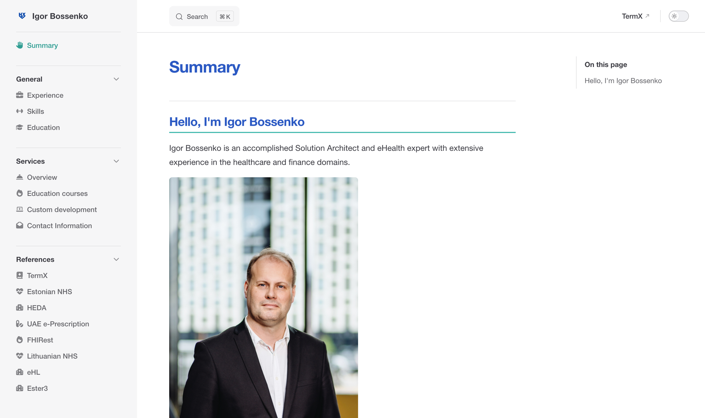

# mdbook

A Markdown + metadata static-site generator for tutorials, specifications and books.
It turns **TermX Wiki** exports and **GitBook** repositories into a fast, searchable,
themeable, multilingual website — and ships as a **GitHub Action**.

Built on [VitePress](https://vitepress.dev) (which uses `markdown-it`), so the TermX
Wiki "smart text" runs natively.

## Showcase

Real sites built with mdbook — click a thumbnail for the live site (see
[Reference projects](#reference-projects) for each one's `.mdbook/config.yml`):

<table>
<tr>
<td width="33%" valign="top"><a href="https://hl7.lt"></a></td>
<td width="33%" valign="top"><a href="https://termx-health.github.io/tutorial/"></a></td>
<td width="33%" valign="top"><a href="https://helex-solutions.github.io/ib-portfolio/"></a></td>
</tr>
<tr>
<td align="center"><a href="https://hl7.lt"><b>HL7 Lithuania Registry</b></a><br><sub>National FHIR IG registry · <code>termx</code> source</sub></td>
<td align="center"><a href="https://termx-health.github.io/tutorial/"><b>TermX tutorial</b></a><br><sub>Docs with smart-text &amp; terminology · <code>termx</code> source</sub></td>
<td align="center"><a href="https://helex-solutions.github.io/ib-portfolio/"><b>Portfolio</b></a><br><sub>Personal site · <code>gitbook</code> source</sub></td>
</tr>
</table>

## Features

- 🔎 **Search** — built-in local full-text search (no external service)
- 🎨 **Skins** — swappable themes (`default`, `ocean`, `paper`, plus brand skins `helex`, `taltech`)
- 🧭 **Menu** — nav & sidebar auto-generated from your content; extendable or overridable in config. On a plain folder tree each top-level section gets its own sidebar, folders sort before files, and a page can set `sidebarTitle` to keep its menu label short
- 🧵 **Orientation at scale** — breadcrumbs above every page, and a **Related** block cross-linking the same document id across parallel trees (a spec ↔ its validation ↔ the story it traces from)
- 🌍 **Multilingual** — first-class locales (default language at `/`, others under `/<lang>/`)
- 🧩 **TermX smart-text** — callouts, tabsets, links-list/grid-list, `+++` collapsibles, `page:`/`cs:`/`vs:`/`concept:` links, `files/` images, page icons, GitBook card tables
- 📊 **Diagrams** — draw.io (including the wiki's versioned `{{drawio:name}}` macro, which always resolves to the newest saved version), Mermaid, and PlantUML (opt-in server, see `diagrams:`)
- 💻 **Code** — Shiki highlighting for every fenced block; a fence that cites a source file (```` ```43:58:src/Foo.java ````) is highlighted by the file's extension and captioned with the path
- 📄 **PDFs** — a PDF stored in the repo is published like a page: listed in the menu, previewed inline and downloadable (see [PDFs](#pdfs))
- 🌐 **OpenAPI** — render one or many OpenAPI 3.1 / 3.0 / Swagger 2.0 documents into searchable reference pages, from a whole document down to a single operation, with an optional try-it console authenticated via OpenID Connect (see [OpenAPI](#openapi))
- 🔗 **Terminology** — `{{def:}}` StructureDefinition viewer, and `{{csc:}}`/`{{vsc:}}` concept tables fetched from a FHIR server at build time
- 🏷️ **SEO** — per-page titles/descriptions, `sitemap.xml`, canonical + Open Graph/Twitter tags, JSON-LD and `robots.txt`. Descriptions, languages and site URL are read from the TermX export when authored (site URL also auto-detected in CI), with first-paragraph/CI inference as the fallback; page **tags** are emitted as `<meta name="keywords">`
- 💬 **Comments** — optional [Giscus](https://giscus.app) (GitHub Discussions) box per page (see [Comments](#comments-github-discussions))
- 🖥️ **Presentation mode** — a fullscreen, chrome-free view with prev/next controls for showing pages to an audience (see [Presentation mode](#presentation-mode))
- 🔍 **Zoom** — a −/+ control in the nav bar scales the article (80–200%, remembered per browser); pair it with `theme.wide` for dense reference tables
- 🔐 **Authentication** — gate the site (or sections of it, or single pages) behind OpenID Connect (Keycloak), enforced server-side by `mdbook serve` (see [Authentication](#authentication))
- 🗂️ **Multi-space portals** — compose several TermX wiki-ssg exports into one site, each space mounted under its own section with its own sidebar and access rules (see [Multi-space portals](#multi-space-portals))

See [`docs/owliki-compatibility.md`](docs/owliki-compatibility.md) for the full
Owliki → mdbook feature matrix.


## Installation

Pick the one that matches how the site is published:

| Way to run it | Use when | Needs |
|---|---|---|
| **GitHub Action** | the site builds in CI (Pages, or rsync to your own server) | nothing — [Quick start](#quick-start--a-new-project) |
| **`npx`** | local authoring and preview | Node ≥ 20 |
| **Docker** | you host it yourself, especially with authentication | a container runtime |

```bash
# Local — no install; npx fetches the repo and runs it
npx github:helex-solutions/mdbook build --project .
npx github:helex-solutions/mdbook dev   --project .

# Self-hosted — generic image, your site mounted at /site
docker run -d --name docs --restart unless-stopped \
  -p 127.0.0.1:8080:8080 -v /srv/docs/mysite:/site \
  ghcr.io/helex-solutions/mdbook
```

The image is public, so that pull needs no login — but it is published **on demand**, not on
every push, so `:latest` can be behind `main`. Upgrading is a pull plus a container *replacement*:
`docker restart` keeps the old image and silently changes nothing. Both are in
[`docs/deployment.md`](docs/deployment.md#upgrading).

An **authenticated** site must be served by `mdbook serve` (the Docker row above, or Node on the
host) — a static host cannot enforce access. Full instructions, including the nginx location and
publishing from CI, are in [`docs/deployment.md`](docs/deployment.md); identity provider setup is
in [Authentication](#authentication).

## Quick start — a new project

1. **Add a `.mdbook/` config folder** to your content repo:

   ```yaml
   # .mdbook/config.yml
   site:
     title: My Docs
     lang: en
   source:
     format: gitbook          # gitbook | termx  (auto-detected if omitted)
   theme:
     skin: default            # default | ocean | paper | helex | taltech | hl7lt
   search: true
   ```

   Also add `.mdbook/.gitignore` with `.cache/` and `dist/`.

2. **Add a deploy workflow** `.github/workflows/mdbook.yml`:

   ```yaml
   name: Publish site
   on:
     push: { branches: [main] }
     workflow_dispatch:
   permissions: { contents: read, pages: write, id-token: write }
   concurrency: { group: pages, cancel-in-progress: true }
   jobs:
     build:
       runs-on: ubuntu-latest
       steps:
         - uses: actions/checkout@v7
         - id: mdbook
           uses: helex-solutions/mdbook@v1.5.0   # pin to a release tag (see Versioning)
           with: { project: . }
         - uses: actions/configure-pages@v6
         - uses: actions/upload-pages-artifact@v5
           with: { path: ${{ steps.mdbook.outputs.site }} }
     deploy:
       needs: build
       runs-on: ubuntu-latest
       environment: { name: github-pages, url: ${{ steps.deployment.outputs.page_url }} }
       steps:
         - id: deployment
           uses: actions/deploy-pages@v5
   ```

3. **Enable GitHub Pages** → repo *Settings → Pages → Source: GitHub Actions*.
   (Pages on a **private** repo needs a paid plan; public repos work on the free plan.)

4. **Push to `main`.** The workflow builds and publishes to `https://<owner>.github.io/<repo>/`.

> **Base path is auto-detected** in CI: `/<repo>/` for a project page, or `/` for a
> custom domain (a `CNAME` file) or an `<owner>.github.io` user/org page. Override with
> `site.base:` in config, the `base:` action input, or `--base`. A `CNAME` in the project
> (root, `public/`, or `.gitbook/assets/`) is copied into the published site.

### Versioning

Pin the action to a **release tag** (e.g. `helex-solutions/mdbook@v1.5.0`) so your site builds are
deterministic — `main` can move without silently redeploying your site. See the
[releases](https://github.com/helex-solutions/mdbook/releases). Use `@main` only if you want the
latest, unreleased changes.

There is deliberately **no floating `@v1`** to track: a moving major tag would redeploy your site
on someone else's schedule, which is the thing pinning exists to prevent. Every published tag is an
exact version, so `@v1` resolves to nothing — upgrade by changing the pin.

**To publish a new mdbook version:**

```bash
git tag -a v1.5.1 -m "…" && git push origin v1.5.1   # patch; v1.6.0 for features
```

Then bump `@v1.5.0` → `@v1.5.1` in each consumer's `.github/workflows/mdbook.yml` and push —
a deliberate step, so upgrades are reviewed rather than automatic.

## Local preview

```bash
npx github:helex-solutions/mdbook build --project .   # build to .mdbook/dist
npx github:helex-solutions/mdbook dev   --project .   # live-reload dev server
npx github:helex-solutions/mdbook serve --project .   # production server (auth-enforcing)
```

(`npx` clones the public repo and runs it; no npm publish needed. Requires Node ≥ 20.)

## Configuration reference — `.mdbook/config.yml`

```yaml
site:
  title: My Space              # falls back to space.json names / repo name
  description: One-line summary
  lang: en                     # default locale
  base: /                      # set to /repo/ for GitHub project pages
  url: https://example.org/    # optional canonical URL (auto-detected in CI);
                               #   enables sitemap.xml, canonical + Open Graph URLs
  logo: /.gitbook/assets/logo.png
  image: /.gitbook/assets/social.png  # optional Open Graph / social image (falls back to logo)
  web: https://example.org     # optional: base for cs:/vs:/page: web links

source:
  format: gitbook              # gitbook | termx  (auto-detected if omitted)
  spaces:                      # termx only — multi-space portal (see Multi-space portals)
    handbook: spaces/handbook  #   mount key -> wiki-ssg export dir
    api: spaces/api
  pdf: true                    # gitbook only — publish repo PDFs as pages (see PDFs)
  exclude:                     # hide files/folders from BOTH the pages and the menu
    - CLAUDE.md                #   bare name -> matches at any depth
    - _templates               #   folder name -> the whole subtree
    - agents/notes             #   path -> matches from the content root
    - "*.draft.md"             #   `*` within a segment, `**` across segments

# Site authentication — see the Authentication section below.
auth:
  issuer: https://sso.example.org/realms/htx   # OIDC issuer (or env AUTH_OIDC_AUTHORITY)
  clientId: owlexicon                          # public or confidential client
  access: public                # site default: public | authenticated | [role, …]
  rules:                        # per-section access; a page overrides via `access:` frontmatter
    - path: internal/**
      access: [editor, admin]

# API reference — see the OpenAPI section below.
openapi:
  specs:                       # name -> local file or URL; pages cite the name
    petstore: ./api/petstore.yaml
  sort: path                   # source (default) | path | summary
  tryIt: true                  # interactive console (default: true)
  auth:                        # only what an OpenAPI document cannot declare
    clientId: docs-portal
    scopes: [openid, profile]
    redirectUri: /oauth2/callback

theme:
  skin: default                # default | ocean | paper | helex | taltech | hl7lt
  wide: false                  # true = full-width layout (sidebar hard left, aside
                               # hard right) for wide tables / reference docs

# `search: true|false`, or an object to keep specific pages out of the index
# (they stay published — one huge generated page can otherwise dominate it).
search:
  enabled: true
  exclude:
    - glossary.md
    - CHANGELOG.md

# Comments (optional) — Giscus / GitHub Discussions, mounted after each page.
comments:
  provider: giscus
  repo: owner/repo
  repoId: R_xxx
  category: Announcements
  categoryId: DIC_xxx
  mapping: owliki          # thread by the stable wiki page code (else: pathname, title, …)

# TermX terminology (optional) — FHIR server for {{csc:}}/{{vsc:}} and cs:/vs: links.
tx-server: https://your-helextx-host/api/fhir

# Diagrams (optional). Mermaid and draw.io need nothing configured. A ```plantuml
# fence, however, is RENDERED BY A SERVER: the source is encoded into a URL and
# every reader's browser fetches the picture from it. There is no default, so
# without this setting a plantuml fence renders as a code block and neither the
# build nor a reader contacts anyone. Set it to opt in — the public server, or
# preferably your own.
diagrams:
  plantumlServer: https://www.plantuml.com/plantuml

# Footer (optional) — shown on every page. Both fields allow inline HTML/links.
footer:
  message: Open source · Collaborative · Interoperable
  copyright: © 2026 Example Org

# Menu — added on top of the auto-generated nav/sidebar.
nav:
  - text: Home page
    link: https://example.org
sidebarExtra:
  - text: Appendix
    items:
      - { text: Glossary, link: /glossary }
# sidebar: [ ... ]             # set to fully OVERRIDE the generated sidebar

# Per-locale menu overrides (multilingual sites). By default the shared `nav`
# above is reused for every locale with its internal links localized
# (/build -> /lt/build); set a locale's `nav` here to fully control its labels
# and links, and `label` to rename it in the language switcher.
locales:
  lt:
    label: Lietuvių
    nav:
      - { text: Pradžia, link: /lt/ }
      - { text: Versijos, link: /lt/build }

build:
  out: .mdbook/dist
```

### Source formats

| Format | Detected by | Layout |
|---|---|---|
| `gitbook` | `SUMMARY.md` | `README.md` (home) + `SUMMARY.md` (nav) + `.gitbook/assets` |
| `owliki` | `pages.json` (in `__source/`, `input/`, or `source/`) | `space.json` + `pages.json` + page markdown (+ `attachments/`) |

> `format: termx` is the former name of the `owliki` format and still works, so a site
> published before the rename keeps building unchanged. New configs should say `owliki`.

**Plain doc trees (no `SUMMARY.md`).** With the `gitbook` format, `SUMMARY.md` is optional:
point mdbook at any folder of markdown and it builds a **per-section sidebar automatically**
from the directory tree (each top-level folder gets its own sidebar so pages stay small on
large repos). Folder labels come from a `README.md` H1 (else the folder name); page labels
from each file's first H1; entries sort naturally (`01-…` before `10-…`). Add a `SUMMARY.md`
later to take manual control of the nav. Arbitrary markdown is also **hardened** for the Vue
compiler — a stray `<Placeholder>`/`</tag>` or `{{ … }}` in prose (common in API specs) is
escaped instead of crashing the build; real HTML, autolinks and code are left intact.

A menu label defaults to the page's first H1 (a folder's, to its `README.md` H1). When that
heading is long or cryptic, set a short label without touching the heading:

```yaml
---
sidebarTitle: ACC.11 Posting
---

# ACC.11 — Posting Rules (Common Spec, Consolidated)
```

### PDFs

A PDF stored in the content repo is published like a markdown page. `specs/handbook.pdf`
becomes the page `/specs/handbook` — listed in the folder-tree menu next to the markdown
pages (with a PDF icon), reachable by breadcrumb, and rendering the file inline with **Open**
and **Download** actions. The file itself is published at its own repo-relative path
(`/specs/handbook.pdf`), so links to it — and links written before mdbook, pointing at the
file in the repo — resolve too.

The rules follow the ones markdown already uses:

- **A markdown page of the same name wins.** With `spec.md` next to an exported `spec.pdf`,
  `/specs/spec` stays the authored page and the PDF stays a plain download. Nothing is
  generated over a page you wrote.
- **`README.pdf` is the folder's index**, at any depth — `reports/README.pdf` is `/reports/`.
- **The page title is the file name**, prettified the way folder-tree labels are:
  `annual-report_2026.pdf` → *Annual Report 2026*.
- **`source.exclude` applies**, so a draft or an internal folder is hidden from the pages and
  the menu in one place. The assets directory (`.gitbook/assets`) and dot-directories are
  skipped — those files are already published as assets.
- **On a gated site** the PDF inherits the access of the page that previews it, so the file
  cannot be fetched around the page (see [Authentication](#authentication)).
- **Not in the search index.** The page carries none of the PDF's text — its body is the
  preview card — so indexing it would add a result whose only searchable words are the file
  name. It stays in the menu and on its breadcrumb trail; it is only absent from search.

Set `source.pdf: false` to keep PDFs out of the site entirely.

**Breadcrumbs and related pages.** Every page gets a breadcrumb trail, and pages whose
filenames start with the same document id in *different* top-level sections are cross-linked
under a **Related** block — so `specifications/acc/ACC.11-…` and
`validations/specifications/acc/ACC.11-…-validation` point at each other. Ids listed in
`traces-from:` / `traces-to:` frontmatter are linked too. Recognised id forms are dotted
(`ACC.11`, `ACC.11.3`) and dashed (`ACC-US-010`, `FLOW-BP-003`); pages without one simply get
no Related block.

**TermX layout.** A TermX Wiki export — or a hand-authored equivalent — is `space.json`
(space metadata), `pages.json` (the page tree) and one markdown file per page. The metadata
and page directories are configurable:

```yaml
source:
  format: owliki
  meta: source          # holds space.json + pages.json + attachments/  (default: __source)
  pages: source/pages   # page markdown, one file per slug
```

`pages.json` is a tree of nodes; each node has a stable `code` and one `contents` entry per
language (`name`, `slug`, `lang`):

```json
[
  {
    "code": "build",
    "contents": [
      { "name": "Builds",   "slug": "build",    "lang": "en" },
      { "name": "Versijos", "slug": "versijos", "lang": "lt" }
    ]
  }
]
```

TermX page bodies use `breaks: true` (a single newline becomes `<br>`), so keep each
paragraph on one line. Images are attachments: `` (served from
`/attachments/…`). See **[helex-solutions/mdbook § reference projects](#reference-projects)**
for complete, working `space.json` / `pages.json` examples.

**Multilingual.** The default language (`site.lang`) is served at the root (`/…`) and other
locales under `/<lang>/…` (VitePress i18n); a language switcher appears automatically.

- *gitbook*: add a `<lang>/` subdirectory with its own `SUMMARY.md` + `README.md` + pages
  (e.g. `lt/…`). `.gitbook/assets` is shared; slugs are parallel (`/build` ↔ `/lt/build`).
- *termx*: each language has its own slug (from `pages.json`), so routes differ
  (`/build` ↔ `/lt/versijos`). mdbook generates **redirect stubs** so the language switcher
  still lands on the correct translation. Per-locale menu labels/links come from `locales`
  in the config.

**Card grids.** A bullet list tagged `{.card-grid}` renders as a responsive card grid. Each
item may carry an image (cover), a heading (title), text (description) and links tagged
`{.button}` (rendered as action buttons; add `.secondary` for an outlined variant). Use
`{.card-grid .cards-row}` for a horizontal (image-left) layout.

```markdown
- 
  ### LT Base
  Core Lithuanian FHIR Implementation Guide.
  [Latest Build](https://build.fhir.org/ig/HL7LT/ig-lt-base){.button}
  [History](https://hl7.lt/fhir/base/history.html){.button .secondary}
{.card-grid}
```

## OpenAPI

Point mdbook at one or more API documents and embed them in your pages. **OpenAPI 3.1**,
3.0 and Swagger 2.0 are all accepted; documents may be local files or URLs.

```yaml
openapi:
  specs:
    petstore: ./api/petstore.yaml
    billing:  https://api.example.com/openapi.json
```

A document behind authentication takes headers, with `${VAR}` resolved from the build
environment — a token belongs in CI, never in a config file:

```yaml
openapi:
  specs:
    mpi:
      url: https://api.example.com/api/mpi/api-docs
      headers:
        Authorization: Bearer ${API_TOKEN}
```

The token is used only to fetch the document; it is never written to the built site or the
cache. If the variable is unset, mdbook says so by name and falls back to the cached copy
rather than failing the build.

Documents are read **at build time**, not in the browser. That means the site works on an
air-gapped network, the docs are pinned to the spec they were built from, and — unlike a
client-side viewer — your API does **not** need to allow CORS from the docs site. A resolved
document is cached, so a later build still succeeds if a remote spec is briefly unreachable.

### Embedding — from whole document to one operation

```
                            the whole document
                 one tag
               every method on a path
  one operation
       one operation, by operationId
           a 3.1 webhook
          one schema
```

Each block expands to **markdown** — headings, parameter/response tables, descriptions — so
operations appear in the page outline and in site search like any other content, and work
with no JavaScript. Only the try-it console is interactive.

### Collapsed by default

A document with hundreds of operations is unreadable fully expanded, so each operation's
detail renders inside a `<details>` and starts **closed** — the page reads as a scannable
list of `METHOD /path` rows. The heading stays outside the fold, so anchors, deep links and
the page outline are unaffected, and because the detail is still in the HTML (merely closed)
it remains fully searchable and prints expanded.

```yaml
openapi:
  collapsed: true    # default; false renders every operation expanded
```

Override per block with `collapsed="false"`:

```

```

### Order and filtering

Operations render in the document's own order by default — for a generated document that is
whatever order the framework happened to emit, which is rarely useful to a reader. Sort them
instead:

```yaml
openapi:
  sort: path         # source (default) | path | summary
```

`path` groups an endpoint's methods together and orders the groups alphabetically, with the
methods themselves in REST order (GET, POST, PUT, PATCH, DELETE…) rather than alphabetically,
so reading a path top to bottom follows the lifecycle. `summary` sorts by the operation's
description. Override per block with `sort="path"`.

A page carrying eight or more operations also gets a **filter box** under its title. Typing
narrows the list live — matching method, path and summary, with multiple words all having to
match — and hides any section heading left with nothing under it. It is progressive
enhancement: without JavaScript the full list is still there, and site search still finds
every operation, because the filter only hides what is already rendered.

### Base URL

The console sends requests to the document's declared `servers`. A generated document often
names the address the *service* sees itself on — springdoc emits `http://127.0.0.1:8080` —
which no reader can reach, so mdbook resolves the base in this order:

1. an explicit `server:` in config (per spec, or one default for all);
2. any declared server that is not loopback;
3. **the origin the document was fetched from** — reachable by definition, since the build
   just used it.

```yaml
openapi:
  server: https://api.example.com   # default for every spec
  specs:
    billing:
      url: https://api.example.com/billing/api-docs
      server: https://staging.example.com   # override for one spec
```

### Calling an API that sends no CORS headers

An API served from the same origin as its own frontend has no reason to send CORS headers —
so a docs site on a *different* origin cannot call it from the browser, and the console
reports `Failed to fetch`. Rather than widening the API's exposure, proxy it through the dev
server: the browser then only talks to the docs' own origin, and CORS never applies.

```yaml
openapi:
  proxy:
    /api: https://api.example.com
```

Applies to `mdbook dev` only. Leave the console's **server** field empty to use it — an empty
field falls back to the page's own origin, which is what the proxy is listening on.

The API document already declares *where* to authenticate — a `securityScheme` of
`type: openIdConnect` carries a discovery URL, and `type: oauth2` carries the endpoints.
mdbook reads those, so config only supplies what a document cannot know:

```yaml
openapi:
  tryIt: true
  auth:
    clientId: docs-portal          # public client
    scopes: [openid, profile, api.read]
    redirectUri: /oauth2/callback  # must be registered with your provider
    issuer: https://id.example.com/realms/x   # only if the spec declares no scheme
    audience: https://api.example.com         # optional
```

mdbook generates the page at `redirectUri` for you. Login is **Authorization Code with
PKCE** — the only flow that is safe for a client that cannot keep a secret. There is
deliberately no support for a client secret or the implicit flow, and the access token is
held in `sessionStorage` (gone when the tab closes), never placed in a URL.

Set `tryIt: false` to render the reference documentation without any console — useful when
the API is internal and only the docs are public.

## Docker

One generic image; the site is a **mounted volume**, so the same image serves every
installation and upgrading mdbook is a tag bump:

```bash
docker run -p 8080:8080 -v /srv/docs/mysite:/site ghcr.io/helex-solutions/mdbook
```

`/site` is a project directory (the one holding `.mdbook/config.yml`). `serve` needs a built
site: either build in CI and mount the result — the mount can then be read-only — or set
`MDBOOK_BUILD=1` to build on start. Any argument runs that command instead of serving, so a
one-shot build is `docker run -v /srv/docs/mysite:/site ghcr.io/helex-solutions/mdbook build`.
See [`docker-compose.example.yml`](docker-compose.example.yml) and
[`docs/deployment.md`](docs/deployment.md); a live example runs at
[tx.helex.dev/mdbook](https://tx.helex.dev/mdbook/) from [`demo/`](demo). Tags are
published on demand by the *Docker image* workflow — see
[publishing the image](docs/deployment.md#publishing-the-image).

Put nginx in front for TLS; when the site is mounted under a path, set `site.base` to match:

```nginx
location /mdbook/ {
    proxy_pass http://127.0.0.1:8080;
    proxy_set_header Host              $host;
    proxy_set_header X-Forwarded-Proto $scheme;
    proxy_set_header X-Forwarded-Host  $host;
}
```

## Multi-space portals

One deployment, many wiki spaces — the Confluence shape. Point `source.spaces` at several
wiki-ssg exports and each mounts under its key (`/handbook/…`, `/api/…`; locales under
`/<lang>/<mount>/…`) with its own sidebar; the nav gets one entry per space and a portal home
page linking the spaces is generated per locale.

```yaml
site: { title: Docs Portal, lang: en }
source:
  spaces:
    handbook: spaces/handbook   # dir with space.json / pages.json / pages/ / attachments/
    api: spaces/api
```

Cross-space `page:<space>/<slug>` links resolve internally when the target space is mounted
(by space code or mount key), attachments are namespaced per mount so page ids from different
TermX instances cannot collide, and access control composes: portal-level `auth.rules` match
mounted paths (`api/**`), a space's exported `ssg.auth` arrives as rules scoped to its mount,
and per-page `access` works as everywhere else — one `acl.json`, one `serve` process, one login
for the whole portal.

## Authentication

Gate the site — or sections of it, or single pages — behind OpenID Connect. Keycloak is the
primary target, but any OIDC provider with a discovery document works. Full design (threat
model, environment mapping, deployment recipes) in [`docs/auth-design.md`](docs/auth-design.md).

```yaml
auth:
  issuer: https://sso.example.org/realms/htx
  clientId: owlexicon
  access: public                 # site default: public | authenticated | [role, …]
  rules:                         # per-section rules; longest path match wins
    - path: internal/**
      access: [editor, admin]
```

A page overrides its section with frontmatter — `access: public | authenticated | [role, …]` —
Confluence-style. The build resolves everything into an `acl.json` manifest next to the dist and
keeps protected pages **out of the search index**; enforcement is the job of the **`serve`**
command:

```bash
mdbook serve --project . --port 8080        # behind nginx (TLS); --build to build first
```

Signing out ends the session at the identity provider, so the reader is signed out of every
application sharing that realm — what sign-out is normally taken to mean. `auth.logout: local`
keeps it to this site instead, for a deployment whose sibling applications must not be disturbed;
that mode then prompts for a fresh login on the next sign-in, so signing out and back in doesn't
silently return the same person.

`serve` performs the OAuth code + PKCE flow server-side and holds the session in a signed
HttpOnly cookie — no token ever reaches the browser, and a plain `` can load a protected
attachment. Unauthenticated visitors are redirected to sign in; authenticated ones lacking the
role get a 403 page naming the role they are missing — rendered by `serve` itself, self-contained,
because a reader denied the site is denied its theme bundle too and a built page would reach them
unstyled. The post-logout landing is rendered the same way, for the same reason.

Gating the **whole** site (`access: [viewer]` with no public section) is supported and is a
different operational proposition: signing in no longer implies reading, so every new reader needs
a role assigned before they see anything. Give the realm a default role, or plan for that step.

Bearer JWTs are accepted too, verified against the configured issuer(s) —
`auth.issuers` lets one site accept several IdPs. Behind a gateway that already authenticates
(oauth2-proxy, Cloudflare Access), skip verification and trust its headers instead:

```yaml
auth:
  trustProxy:
    userHeader: X-Auth-Request-User
    rolesHeader: X-Auth-Request-Groups
```

Secrets and identity config come from the environment when omitted from config —
`AUTH_OIDC_AUTHORITY`, `AUTH_OIDC_CLIENT_ID`, `AUTH_OIDC_CLIENT_SECRET`, `AUTH_SESSION_SECRET`,
`AUTH_ROLE_CLAIMS`, and `GUEST_DISABLED=true` to require login for the whole site.

Setting up the provider — realm, public client, the roles claim mdbook reads, federated login
(Google) and how to verify enforcement without a browser — is in
[`docs/keycloak.md`](docs/keycloak.md).

A gated site **cannot** live on GitHub Pages or any dumb static host — client-side gating on
such a host is cosmetic. Deploy the dist to your own server and run `serve` there; the GitHub
Action does this in one step:

```yaml
- uses: helex-solutions/mdbook@v1.5.0
  with:
    project: .
    deploy-target: deploy@docs.example.org:/srv/docs/site
    deploy-key: ${{ secrets.DOCS_DEPLOY_KEY }}
    deploy-post: sudo systemctl restart mdbook-docs   # only when acl/config changed
```

Sites without an `auth:` block build and deploy exactly as before, anywhere.

## Comments (GitHub Discussions)

mdbook can render a [Giscus](https://giscus.app) comment box after each page, backed by
**GitHub Discussions**. To enable it:

1. **Enable Discussions** on the repository: **Settings → General → Features → ☑ Discussions**.
2. **Install the giscus app** from <https://github.com/apps/giscus> and grant it access to the repo.
3. **Get the IDs**: open <https://giscus.app>, enter the repository, pick (or create) a Discussion
   **category** (e.g. *Comments*), then copy the generated `repoId` (`R_…`) and `categoryId` (`DIC_…`).
4. **Add a `comments` block** to `.mdbook/config.yml` and rebuild:

   ```yaml
   comments:
     provider: giscus
     repo: owner/repo
     repoId: R_xxxxx
     category: Comments
     categoryId: DIC_xxxxx
     mapping: owliki     # thread by the stable wiki page code (survives renames);
                         #   or use pathname / title / og:title
   ```

   `mapping: termx` is the former name of `owliki` and still works. Both resolve to the
   **same** discussion term, so switching a published site's config from one to the other
   keeps every existing thread. The page code is also published as
   `<meta name="owliki:page">` (and, for older readers, `<meta name="termx:page">`).

Readers post with a one-time **“Sign in with GitHub”**; comments are stored as Discussions in the
repo (moderate/reply there or inline), and the widget follows the site's light/dark theme. Omit the
`comments` block to disable it.

## Presentation mode

A floating **⛶** button in the bottom-right corner of every page toggles a distraction-free view
for showing pages to an audience: it requests fullscreen and hides the nav, sidebar and
on-this-page aside, leaving only the article.

- **‹ / ›** edge buttons — or the **← / →** keys (also PageUp/PageDown) — move to the previous/next
  page in sidebar order.
- **Esc**, or the button (now a ⤢ exit icon), leaves the mode.

It stays on as you navigate and follows the site's light/dark theme. No configuration needed — the
button is always available.

## How it works

1. **Ingest** — a format adapter reads your content into a unified model
   (title, languages, per-locale sidebars, content files, assets).
2. **Stage** — content is copied into a scratch VitePress project under `.mdbook/.cache/`,
   with a generated `.vitepress/config.mjs` and a theme entry for the selected skin;
   TermX smart-text is transformed/expanded here.
3. **Build** — VitePress renders the static site to `.mdbook/dist`.

## Reference projects

Real repositories you can copy from — each links the live site and its `.mdbook/config.yml`:

| Project | Source | Live site | Repo |
|---|---|---|---|
| HL7 Lithuania Registry | `owliki` (en/lt) | <https://hl7.lt> | [HL7LT/hl7lt-website](https://github.com/HL7LT/hl7lt-website/blob/main/.mdbook/config.yml) |
| TermX tutorial | `owliki` (en/lt) | <https://termx-health.github.io/tutorial/> | [termx-health/tutorial](https://github.com/termx-health/tutorial/blob/main/.mdbook/config.yml) |
| Portfolio | `gitbook` | <https://helex-solutions.github.io/ib-portfolio/> | [helex-solutions/ib-portfolio](https://github.com/helex-solutions/ib-portfolio/blob/main/.mdbook/config.yml) |

Each config option, and a project that uses it:

| Config | Example project(s) |
|---|---|
| `source.format: gitbook` (`SUMMARY.md` + `README.md` + `.gitbook/assets`) | portfolio |
| `source.format: owliki` + `meta` / `pages` (under `source/`) | hl7lt-website, tutorial |
| `site.url` (sitemap, canonical, Open Graph) | hl7lt-website |
| `theme.skin` | hl7lt-website (`hl7lt`), tutorial (`helex`), portfolio (`default`) |
| `search` | all three |
| `footer` (`message` + `copyright`) | hl7lt-website, tutorial |
| `nav` | hl7lt-website |
| `locales` (per-locale menu labels/links) | hl7lt-website |
| `tx-server` (`{{csc:}}` / `{{vsc:}}` tables, `cs:` / `vs:` links) | tutorial |
| `{{def:}}` StructureDefinition viewer | tutorial |
| `{.card-grid}` card grids | hl7lt-website, tutorial |
| Multilingual + locale-switch redirect stubs (`pages.json`) | hl7lt-website, tutorial |
| `comments` (Giscus) | see [Comments](#comments-github-discussions) above |

## License

MIT
