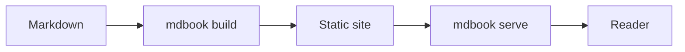
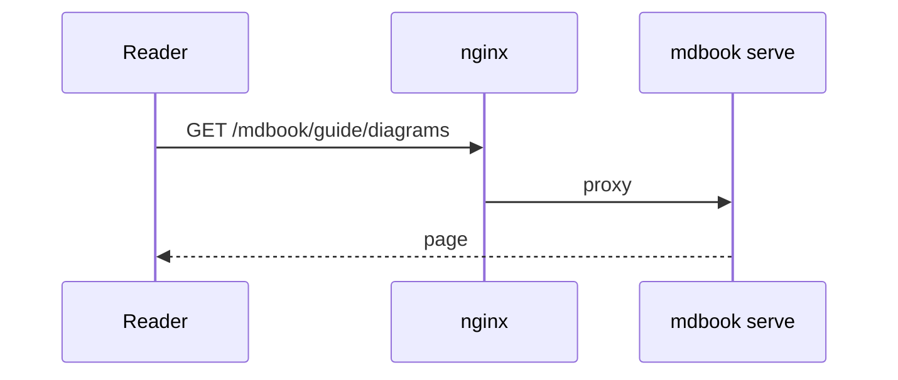

# Diagrams

## Mermaid

```mermaid
flowchart LR
  A[Markdown] --> B[mdbook build]
  B --> C[Static site]
  C --> D[mdbook serve]
  D --> E[Reader]
```

## Sequence

```mermaid
sequenceDiagram
  participant R as Reader
  participant N as nginx
  participant M as mdbook serve
  R->>N: GET /mdbook/guide/diagrams
  N->>M: proxy
  M-->>R: page
```
